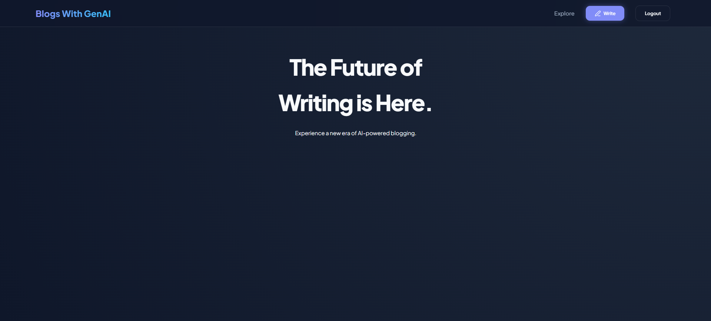
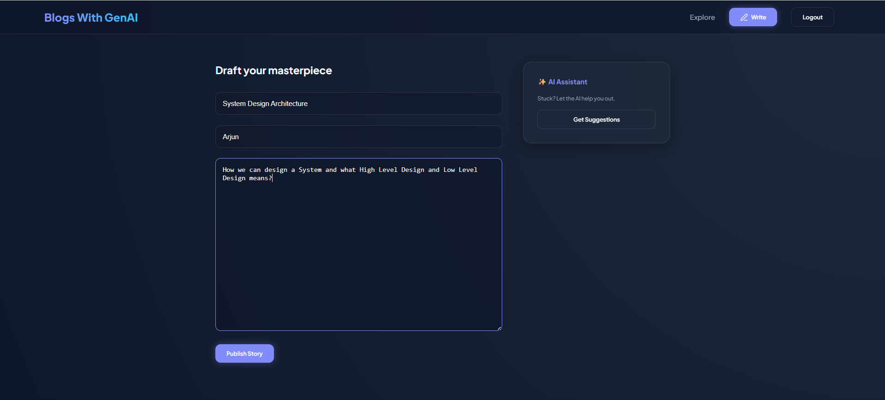
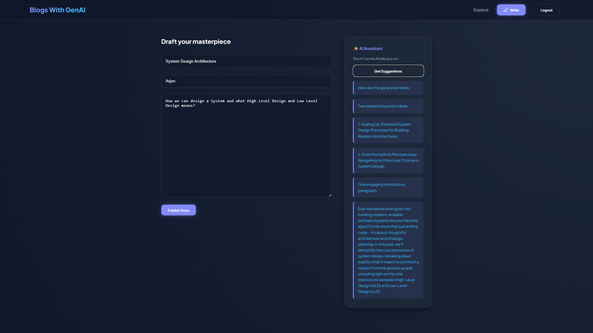
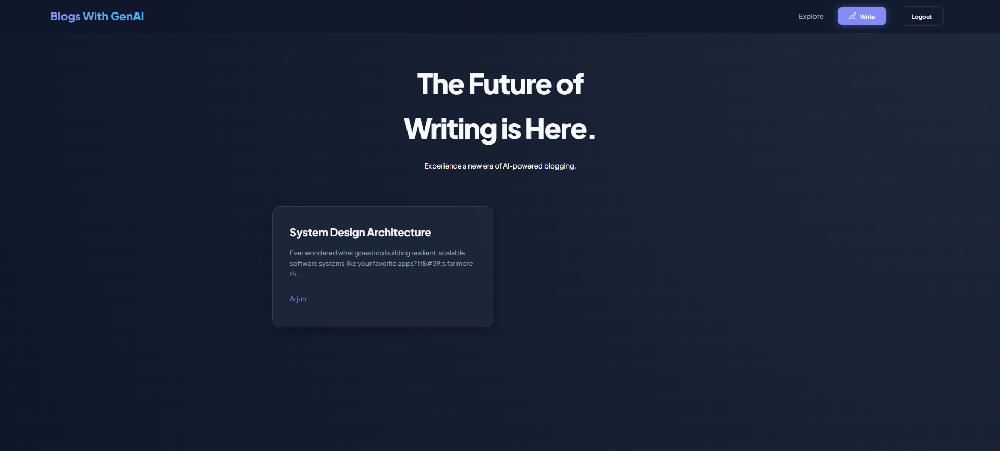
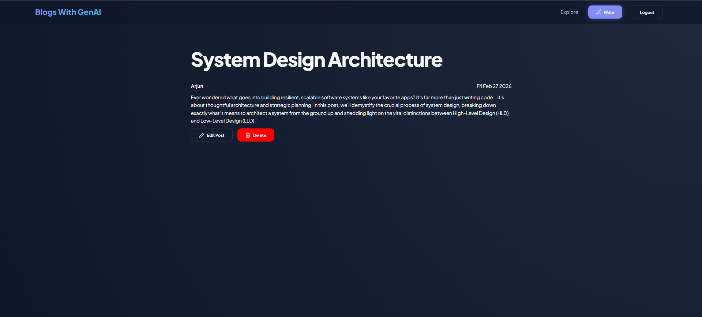
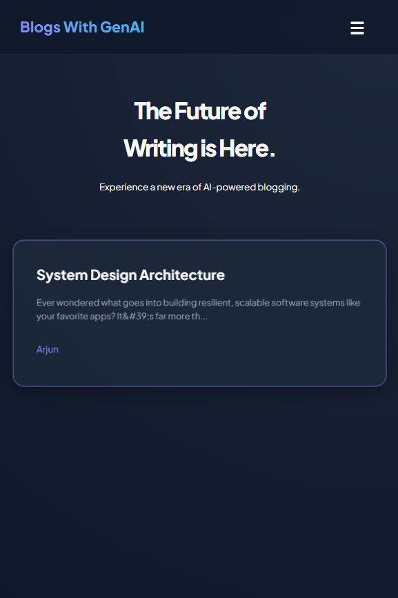
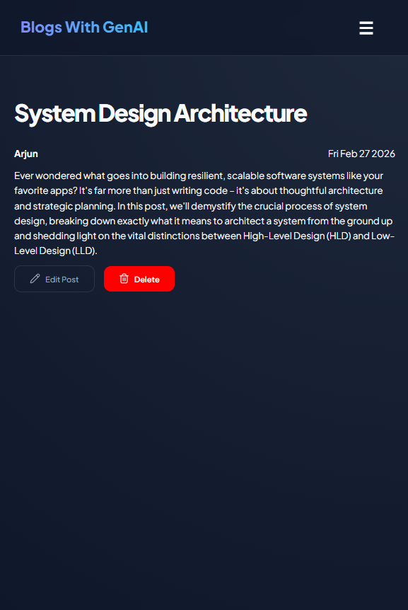
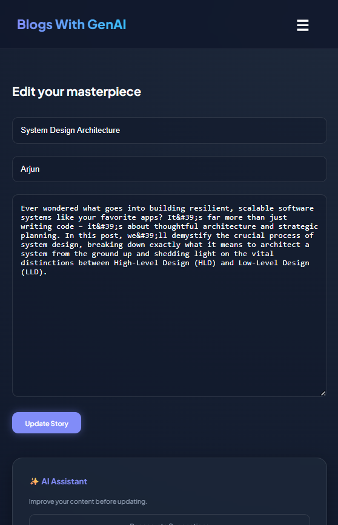

# Blog Application with GenAI Content Suggestions

- A full-stack Blog application built with React (Vite), Node.js (Express), SQLite, and Google Gemini LLM. 
- Users can create, edit, and delete the blog posts. while leveraging AI to generate related topic ideas and introductory paragraphs before publishing.
- The system follows clean REST architecture, secure JWT authentication, rate limiting for AI protection, and environment-based configuration.

## Live Demo

### Frontend : [https://blog-application-with-gen-ai-sugges.vercel.app/] (https://blog-application-with-gen-ai-sugges.vercel.app/)

### Backend API : [https://blog-application-with-genai-suggestions.onrender.com/] (https:/blog-application-with-genai-suggestions.onrender.com/)

## Sample UI Screenshots

### Initial UI


### Creating_A_Blog 


### AI Suggestions


### Blog Preview


### Full Blog


### Edit Blog


### Mobile Responsiveness




## System Architecture

```
User (Browser)
       |
React Frontend (Vite)
        |
Express Backend API
        |
SQLite Database (Blogs + Users)
        |
Gemini LLM (Content Suggestions)
```

### Architecture Highlights

- **Stateless REST API:** Clean separation of concerns for frontend and backend.
- **AI Integration Layer:** Gemini LLM used for structured blog suggestions.
- **Persistent Storage:** SQLite for blogs and user authentication.
- **JWT Authentication:** Secure protected routes for write, edit, delete.
- **Rate Limiting:** Prevents AI endpoint abuse.
- **Centralized Error Handling:** Centralized error handling and ESM-standard module resolution.

## Tech Stack
- **Frontend:** React.js (Vite), React Router DOM, Axios, Responsive CSS (Custom Styling), LocalStorage (JWT handling)
- **Backend:** Node.js (Express), SQLite (persistent storage), JWT Authentication, express-rate-limit, dotenv, Gemini LLM SDK
- **Database:** SQLite
- **LLM:** Google Gemini (gemini-2.5-flash)

## Project Structure
- `/frontend`: React application (UI, Chat Interface, Session Management)
- `/backend`: Express API (LLM Orchestration, SQLite Integration, Rate Limiting)


## Core Features

- **Blog Management:** Create, Edit, View and Delete blogs details.
- **AI-Powered Suggestions:** Generates 2 related topic ideas, 1 introductory paragraph and clean structured AI output formatting.
- **Authentication:** Registers user, Logins user and JWT-based protected routes.
- **UI/UX:** Responsive Layout, structured blog card layout, and mobile hamburger navigation.
- **Error Handling:** Centralized Error Handling.
- **Rate Limiting:** Basic IP-based protection for the API.
- **Environment Variables:** Environemt based configuration

## Security & Reliability

- **Secret Management:** API keys stored in `.env` with `.gitignore` protection.
- **Resilient Startup:** Fail-fast mechanism if critical environment variables (e.g., `GEMINI_API_KEY`) are missing.
- **Traffic Control:** Rate limiting implemented to prevent abuse and protect API quotas.
- **AI Suggestions:** Strict context injection to produce accurate AI suggestions.
- **Clean Architecture:** Centralized error-handling middleware and robust input validation for all API endpoints.

## Database Schema

### Table: `users`
| column     | type     | notes       |
| ---------- | -------- | ----------- |
| id         | INTEGER  | Primary Key |
| email      | TEXT     | Unique      |
| password   | TEXT     | Hashed      |
| created_at | DATETIME | Timestamp   |

### Table: `messages`
| column     | type     | notes        |
| ---------- | -------- | ------------ |
| id         | INTEGER  | Primary Key  |
| title      | TEXT     | Blog title   |
| content    | TEXT     | Blog content |
| author     | TEXT     | Author name  |
| user_id    | INTEGER  | Foreign key  |
| created_at | DATETIME | Created time |
| updated_at | DATETIME | Updated time |

## AI Integration Logic

- The AI endpoint (POST /api/ai-suggestions) constructs a structured prompt:

### Prompt Construction Logic

You are an expert blog assistant.

Title: ${title}
Content: ${content}

**Generates:**

- Two related blog topic ideas
- One engaging introductory paragraph
- Return response in clean bullet format.

### Output Processing

**The backend:**

- Splits AI response by newline
- Removes markdown artifacts (*, **)
- Returns structured suggestion array

# API Documentation

## 1. Create Blog

### `POST /api/blogs`

Creates a blog.

### Request:

```json
{
  "title": "Blog Title",
  "content": "Blog content",
  "author": "Author Name"
}
```

### Response:

```json
{
  "message": "Blog post created successfully",
  "postId": 1
}
```

## 2. Get All Blogs

### `GET /api/blogs`

Returns all blogs ordered by latest first.

### Response:

```json
[
    {
        "id": 1,
        "title": "My Blog",
        "content": "<p>Generative AI is used to generate the content after learning from the huge amount of data</p>\n",
        "author": "Mallikarjun",
        "user_id": 1,
        "created_at": "2026-02-26 22:27:53",
        "updated_at": "2026-02-26 22:27:53"
    }
]
```

## 3. Get Blog By Id

### `GET /api/blogs/:id`

Returns single blog object.

### Response:

```json
{
    "id": 1,
    "title": "My Blog",
    "content": "<p>Generative AI is used to generate the content after learning from the huge amount of data</p>\n",
    "author": "Mallikarjun",
    "user_id": 1,
    "created_at": "2026-02-26 22:27:53",
    "updated_at": "2026-02-26 22:27:53"
}
```

## 4. Update Blog

### `PUT /api/blogs/:id`

Updates a blog

### Request:

```json
{
  "title": "My Blog",
  "content": "Generative AI is used to generate the content after learning from the huge amount of data",
  "author": "Arjun"
}
```

### Response:

```json
{
    "message": "Blog updated successfully"
}
```

## 5. Delete Blog By Id

### `DELETE /api/blogs/:id`

Deletes single blog object.

### Response:

```json
{
    "message": "Blog deleted successfully"
}
```

## 6. AI Suggestions

### `POST /api/ai-suggestions`

Generates AI suggestions.

### Request:

```json
{
  "title": "Start to Production",
  "content": "In this article, we explore the flow of an app from the frontend to backend."
}
```

### Response:

```json
{
    "suggestions": [
        "*   **Related Blog Topic Ideas:**",
        "    *   Building RESTful APIs with Node.js and Express: A Developer's Guide",
        "    *   Deploying Your React-Node Web App: From Development to Production",
        "*   **Engaging Introductory Paragraph:**",
        "    Dreaming of bringing your web app ideas to life? In today's fast-paced digital world, building a modern, responsive web application is an essential skill for any aspiring developer. This article is your comprehensive guide to mastering the art of full-stack development, as we delve into creating powerful web applications from the ground up using the unbeatable duo of React for captivating front-end user interfaces and Node.js for robust, scalable backend services."
    ]
}
```

## Testing & Verification

### Blog Creation

- Create → Redirect → Appears on homepage.

### Blog Editing

- Edit → Prefilled → Update → Redirect to detail.

### Blog Deletion

- Delete → Confirm → Redirect → Removed from DB.

### AI Suggestions

- Generate suggestions → Clean structured output.

### Authentication

- Unauthenticated user cannot modify blogs.

### Mobile Responsiveness

- Hamburger navigation works under 768px.

# Setup Instructions

## Prerequisites

### Make sure you have installed:

- **Node.js** (v18 or higher)
- **npm** (comes with Node)
- **Git**

### Check versions:

```bash
node -v
npm -v
git --version
```

## Clone the Repository
```bash
git clone https://github.com/MMALLIKARJUN2312/Blog_Application_With_GenAI_Suggestions
cd Blog_Application_With_GenAI_Suggestions
```

## Backend Setup (Node.js + Express + SQLite)

### Navigate to Backend

```bash
cd backend
```

### Install Dependencies

```bash
npm install
```

### Configure Environment Variables

- **Copy .env.example to .env:**

```bash
cp .env.example .env
```

- **Edit .env and add your LLM API_KEY:**

```env
PORT=5000
GEMINI_API_KEY=your_gemini_api_key_here
JWT_SECRET=your_secret_key_here
```

### Database Setup

- SQLite database file (database.sqlite) is created automatically.
- users and messages will be created automatically.
- No manual setup is required.

### Start Backend Server

### Development Mode:

```bash
npm run dev
```

### Production Mode:

```bash
npm start   
```

Backend runs at: [http://localhost:5000](http://localhost:5000)

## Frontend Setup (React.js)

### Navigate to Frontend

```bash
cd frontend
```

### Install Dependencies

```bash
npm install
```

### Configure API Base URL (if backend port differs)

**Edit frontend/src/api.js** 

- export const API_BASE_URL = "http://localhost:5000"

### Start React App

### Development Mode:

```bash
npm run dev
```

### Production Mode:

```bash
npm run build
npm run preview   
```

Frontend runs at: [http://localhost:5173](http://localhost:5173)